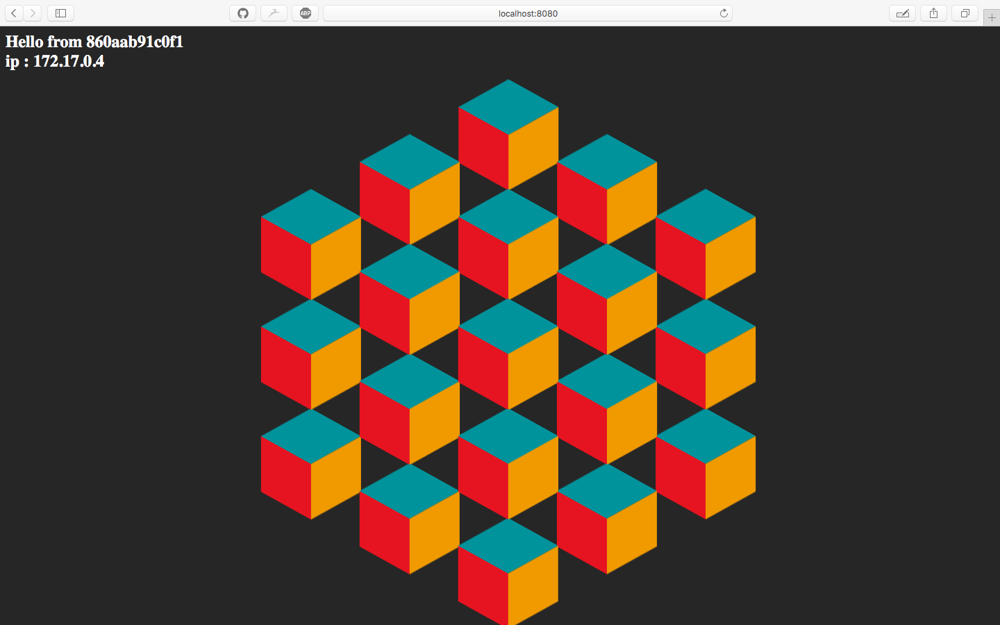

# displayInfo

## Run from dockerhub 

https://hub.docker.com/r/cl3m3nt/displayinfo/

[](https://hub.docker.com/r/cl3m3nt/displayinfo/)
[]((https://hub.docker.com/r/cl3m3nt/displayinfo/)

```
$ docker run -it --rm -p 8080:5000 -d cl3m3nt/displayInfo
```

# OR


## Build your Dockerfile

```
$ docker build -t local/displayInfo .
```

## Run your Dockerfile

```
$ docker run -it --rm -p 8080:5000 -d local/displayInfo
```


## Screen


